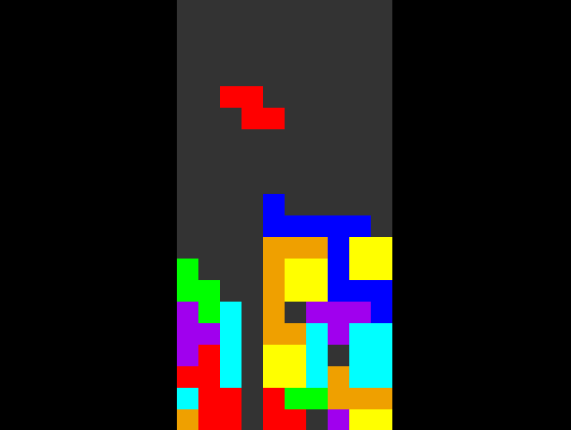

### Tetris written in [High Level Assembly](https://en.wikipedia.org/wiki/High_Level_Assembly) ([download](https://www.plantation-productions.com/Webster/HighLevelAsm/LInuxDownload.html)) and X.  

Instructions written for Ubuntu/Debian-based systems.  

Requires 32-bit libX11.
```
sudo dpkg --add-architecture i3816
sudo apt update
sudo apt install libx11-dev:i386
```

Building:
```
mkdir -p build
hla tetris.hla -l"melf_i386 -dynamic-linker /lib/ld-linux.so.2 /lib/i386-linux-gnu/libX11.so.6.3.0" -x:tetris.out -obj:build
```
Change the libX11 path if needed.  

Controls:
* `LEFT`/`RIGHT`: Move horizontal
* `DOWN`: Move down (**frequently gets stuck**)
* `UP`: Rotate

NOTE: Uses regular RNG instead of the standard "piece bag" system.  



[MIT](LICENSE.txt) Copyright (c) 2022 GreenXenith
